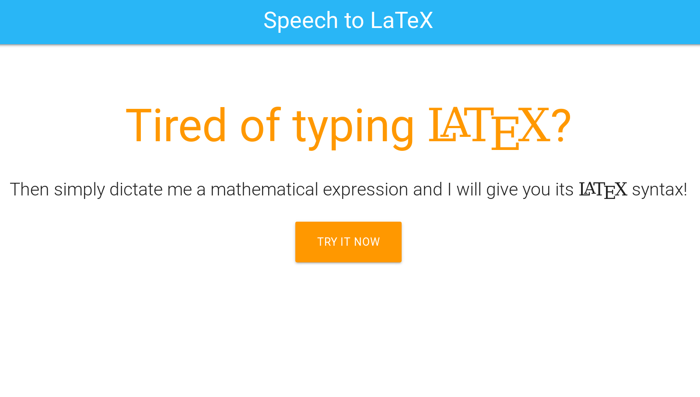

# Speech to Latex

[PolyHacks](http://www.polyhacks.com/) 2017 project, improved a bit later. Try it here: [speech-to-latex.agoetschm.com](http://speech-to-latex.agoetschm.com/)

## How to run locally

After cloning and runnning `npm install`, you need to set [Google Application Default Credentials](https://developers.google.com/identity/protocols/application-default-credentials). You can then run `nodemon` to build and start the app.
